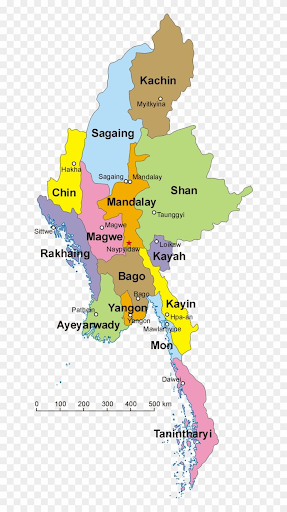

#### 地図

#### 基本情報

　名称：ミャンマー連邦共和国（Republic of the Union of Myanmar）  
　言語：ビルマ語（公用語）  
　　　　多民族国家である

1. カチン族
2. カヤー族
3. カレン族
4. チン族
5. ビルマ族
6. モン族
7. ラカイン族
8. シャン族

[衣装](https://www.google.com/search?sca_esv=3da4db664be6b3a1&sxsrf=AHTn8zo-RnqrY_Z60_8fvIvws9MDY_JQbg:1744477794843&q=myanmar+longyi&udm=2&fbs=ABzOT_CWdhQLP1FcmU5B0fn3xuWpA-dk4wpBWOGsoR7DG5zJBnsX62dbVmWR6QCQ5QEtPRqut5gkyra9fZFbsKm1oGezZfNjBY6JC6SkJAVAOI0b5CsapIcNDC3CIOSVGb5pDJnvaDBV6lWSpY5E2wxgZzrkXalu80uOY_e8XXgkMygvMBqwPOEgIqQSHrDce0QWSpCKVluLj6UL7-OYkp3g8b-Q1-cSJw&sa=X&sqi=2&ved=2ahUKEwiuzZ6a_tKMAxXSslYBHbQeEjYQtKgLegQIFxAB&biw=2560&bih=1313&dpr=1)

#### 食べ物

- モンヒンガー  
  
主に朝食として人気  
魚のスープをベースにした米粉の麺料理  
レモングラス、バナナの茎、生姜、にんにく  
トッピング：ゆで卵、フライドオニオン、パクチー  

日本語字幕あり  
作り方 →　https://youtu.be/LxYbEl5iaHI?si=1KHqhiJN_GYayZ69

- ウナギ  
  
 作り方 →　https://youtu.be/pSBiojMydsQ?si=BpW7ddqJEMC2qh5N
 
#### チン族が主に住んでいる地域へ招く歌

[ချင်းတောင်တန်းမှကြိုဆိုပါ၏ ](https://youtu.be/eX-sHp8lX-Q?si=Aqj94Srhd5MeXHsO)  

[index](index.md)