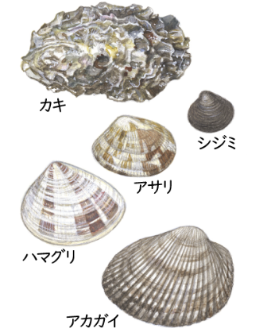
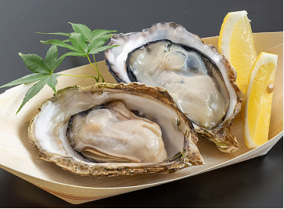

### かき小屋（ごや）- Oyster hut

   
    
    

### 語彙

海中の岩などについている二枚貝。肉は食用にする。各地で養殖される。

|#| ことば |　読み方  | 意味 |
|-| ----- | ------- | ---- |
|1| カキ　 |
|2| シジミ　 |
|3| アサリ  | 　 |clam |
|4| ハマグリ | 　 |clam |
|5| アカガイ| 　 |red clam |
|6| 海中 | かいちゅう|海のなか|
|7| 岩　| いわ| a rock |
|8| 二枚貝 | にまいがい | clams ခရု |
|9| 食用 | しょくよう | 食べられる စားသုံးနိုင်သော|
|10| 各地 | かくち  |everywhere|
|11| 養殖 | ようしょく | ငါးပုစွန်မွေးမြူရေး|
|12| 海 | うみ | sea |

[index](index.md)
