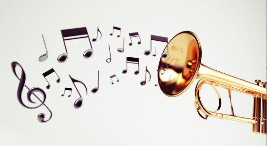

### 音楽の力 
〜心と体を動かす不思議なエネルギー〜

- 音の芸術・感情表現の手段
- 世界中で共通の言語
- 文化・時代を超えるコミュニケーション

#### 音楽の心理的効果

- 気分を高めたり、落ち着かせたりする
- ストレスを軽減し、リラックス効果がある
- 記憶や感情を呼び起こす力がある

#### 音楽の身体的効果

- 脳を活性化し、集中力を高める
- リズム運動と連動し、運動効果を高める
- 心拍数や血圧に影響を与えることもある

#### 音楽と社会

- 教育の場で：言語学習や感性教育に活用
- 医療の場で：音楽療法として使用
- 災害時や困難な時期に、人々を励ます役割

#### 音楽の力の実例

- 被災地での復興支援ライブ
- 認知症患者の記憶が音楽でよみがえる
- 世界中のチャリティソングの力

#### その他

- 私たちの生活に欠かせない「癒し」と「エネルギー」

#### Article

How does our brain respond to music?  
What impact does it have on us?  
What are the benefits of listening to music?  

Sure! Here's the text from the image you uploaded, now fully selectable and copyable:

---

`Nietzsche` once said that life without music would be a mistake. Do you agree with him? Is music essential for human beings? Did you know that listening to music is one of the few activities that involves using the whole brain?

Throughout numerous studies, researchers have found out that music can help dealing with stress related to heart diseases and it can improve verbal IQ. In this sense, it enhances cognitive skills. People who suffer from memory problems or brain injuries can also benefit from music, as it has been proven that listening to certain pieces may bring back old memories. A part from being relaxing, slow music -classical or celtic, for instance- reduces blood pressure. Therefore, people with high blood pressure can lower it if they listen -at least 30 minutes per day- this kind of music.

The cathartic effect of music is well-known in all cultures, meaning it offers positive results on mood and pain management, reducing the feeling of anxiety or suffering. Technically, during music time, our body releases endorphines to fight pain. In fact, some researches show that listening to music can lower depression rates by up to 25%. It seems that somehow, music gives people a sense of control.

Another particularity about music is that people tend to associate it with certain colors. For example, a study developed in Mexico and the United States in 2013 showed that people connected dark colours to sad melodies, while more cheerful colours were linked to happier pieces of music. Thus, this means music evokes colors in our minds.

Learning a new language -in your case, English- is easier if we sing the phrases when we practice at home, rather than just reading them. It apparently helps with pronunciation and aids remembering relevant information.

One curious fact is that listening to only 15 seconds of music per day can change the way we perceive other people’s faces: that is, if we listen to joyful music, we’ll be more likely to think that the other person is happy, and the opposite thing happens with melancholic music, even if people have a neutral facial expression.

In 1911, an American researcher, Leonard Ayres found out that music can also help exercise, as he observed that cyclists who listened to music pedaled faster than those who didn’t, and allowed them to exercise longer, they used their energy more efficiently. The scientific explanation for this is that music covers up fatigue, so our brain is less aware of tiredness because it’s more focused on music.

Music has undeniably been something intrinsic to manhood since ancient times. As you’ve seen, in the last decades, scientists have discovered a bunch of benefits that music provides us with; there is, though, still a long way to go in this field, to see exactly how the brain responds to music and the impact it has.

---

#### 用語

- `cognitive`: realted to the process of knowing, understanding, and learning something.
- `cathartic`: helping you to remove strong or violent emotions
- `endorphins`: are natural chemicals produced by your brain and nervous system that help relieve pain and boost feelings of pleasure or happiness.  
They’re often called “feel-good” hormones because they can improve your mood and reduce stress.
- `evoke`: to bring a feeling, memory, image, or idea into your mind.
- `perceive`: to become aware of or to understand something through your senses or your mind.
- `melancholic`: feeling very sad.
- `neutral facial expression`: a face that shows no strong emotion — not happy, sad, angry, or surprised.
- `cyclists`: people who ride bicycles.
- `pedaled`: the past tense of "pedal" — to push the pedals of a bike with your feet to make it move.
- `fatigue`: extreme tiredness or exhaustion, usually from physical or mental effort.
- `intransic`: naturally part of something; built-in or essential by nature.
- `impact`: the effect or influence something has.  
            a strong force or collision.  

[index](index.md)