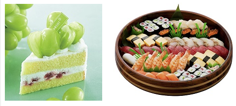

### ～そうです。(話し手の気持ちを表す表現)

例： **ケーキ、すし**  

- このすしはおいしそうです。  
- このケーキはおいしそうです。

1. 家（古い）→　家は古いそうです。
2. アパート（新しい）→　アパートは新しいそうです。
3. マンション（便利）→　マンションは便利だそうです。
4. 学生（眠い）→　学生は眠そうです。
5. おじいさん（元気）→　元気そうです。

#### そうな　+　名詞
例:すし　→　おいしいそうなすしです。
1. 料理　→　おいしそうな料理
2. 弁当　→　おいしそうなお弁当

例：お腹が痛い → お腹が痛そうです。
1. うれしい → うれしそうです。
2. 悲しい   → 悲しそうですね。
3. 眠い     → 眠そうです。
4. 忙しい   → 忙しそうです。
5. 気分が悪い → 気分がわるそうです。

### Conclusion

|                | (I hear that...)          | It looks like...          |
|----------------|---------------------------|---------------------------|
| **動詞 (V)**      | 話す → 話すそうです         | --                       |
| **い形容詞 (い-adj)** | おいしい → おいしいそうです | おいしそうです            |
| **な形容詞 (な-adj)** | 元気だ → 元気だそうです      | 元気そうです            |
| **名詞 + です (N + です)** | 学生だ → 学生だそうです      | --               |
| **特例 (いい)**  | いい → いいそうです         | よさそうです              |

|                       | It looks like...                              |
|-----------------------|-----------------------------------------------|
| **そうな + 名詞 (N)**  | 暖かそうなセーター (It looks like a warm sweater) |
| **そうに + 動詞 (V)**  | 悲しそうに泣いている (Crying as if sad)         |
| **～ない**            | 雨が降らなさそうです (It doesn’t look like it will rain) |
