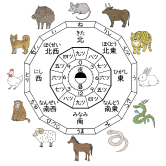

### 十二支（じゅうにし）

上記の画像にある言葉を勉強しましょう。

|#| ことば |　読み方  | 意味 |
|-| ----- | ------- | ---- |
|1|十二支   | じゅうにし | ရာသီခွင်|
|2| 子  | ね（ねずみ）　 |mouse ကြွက်|
|3| 丑  | うし |Ox |
|4| 寅  | とら |Tiger |
|5| 卯  | う（うさぎ）| Rabbit |
|6| 辰  | たつ（りゅう）| Dragon |
|7| 巳  | み（へび）|Snake |
|8| 午  | うま |Horse |
|9| 未  | ひつじ |Sheep |
|10| 申  | さる | Monkey |
|11| 酉  | とり（にわとり）|Rooster |
|12| 戌  | いぬ　|Dog |
|13| 亥  | いのしし |Pig |
|14| 方角 | ほうがく | အရပ်မျက်နှာ|
|15| 時刻 | じこく　 | Time |
|16| 北  | きた　 |North |
|17| 北東 | ほくとう　 | northeast |
|18| 東  | ひがし　 | east |
|19| 南東 | なんとう　 |southeast |
|20| 南  | みなみ　 |south |
|21| 南西 |なんせい |southwest |
|22| 西  | にし |west |
|23| 北西 | ほくせい |northwest |

