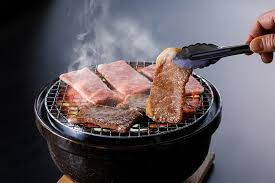

### 焼肉（やきにく）အသားကင်

| No | 言葉       | よみかた         | 意味                           |
|----|------------|------------------|--------------------------------|
| 1  | 焼肉       | やきにく         | 焼いた肉 (အသားကင်)                       |
| 2  | タレ       | たれ             | ソース （with sushi, nabemono, and gyoza) |
| 3  | 塩         | しお             | 塩 (ဆားငန်)                            |
| 4  | レア       | れあ             | 生焼け (မကျက်သေး) なまやけ            |
| 5  | ミディアム |                  | 中くらいの焼き加減（အလယ်အလတ်ကင်)     |
| 6  | ウェルダン |                  | よく焼いた                      |
| 7  | 網         | あみ             | グリルの網 （ကင်ကွက်）                     |
| 8  | 炭火       | すみび           | 炭火　（မီးသွေး）                            |
| 9  | 野菜       | やさい           | 野菜  （ဟင်းသီးဟင်းရွက်များ）                 |
| 10 | 焼く       | やく             | 焼く                            |
| 11 | 追加注文   | ついかちゅうもん  | 追加の注文                      |
| 12 | ご飯       | ごはん           | ご飯                            |
| 13 | お冷       | おひや           | 冷たい水                        |
| 14 | お会計     | おかいけい       | 会計                            |
| 15 | タン       | たん             | 牛の舌 (အမဲသားလျှာ)                        |
| 16 | カルビ     | かるび           | 牛のあばら肉 (အမဲနံရိုး)                       |
| 17 | ロース     | ろーす           | 牛の背肉 (beef ကျောအသား)                  |
| 18 | ハラミ     | はらみ           | 牛の横隔膜 (beef အဆီခွံ)                     |
| 19 | ナムル     | なむる           | 韓国風の和え物 (Korean Style Salad)         |
| 20 | キムチ     | きむち           | 辛い漬物   (Spicy pickles)                     |
| 21 | 豚バラ     | ぶたばら         | 豚のあばら肉  (ဝက်နံရိုး)                  |
| 22 | トントロ   | とんとろ         | 豚の首肉    (ဝက်သားလည်ပင်း)                    |
| 23 | 豚ロース   | ぶたろーす       | 豚の背肉  (ဝက်သားနောက်ကျော)                      |
| 24 | 豚トロ     | ぶたとろ         | 豚の頬肉  (ဝက်သားပါးပြင်အသား)                      |
| 25 | 豚もも     | ぶたもも         | 豚のもも肉    (ဝက်သားပေါင်)               |
| 26 | 豚ハラミ   | ぶたはらみ       | 豚の横隔膜    (ဝက်အမြှေး)                  |
| 27 | 豚ホルモン | ぶたほるもん     | 豚の内臓肉   (ဝက်ကလီစာ)                   |
| 28 | 豚タン     | ぶたたん         | 豚の舌   (ဝက်သားလျှာ)                        |
| 29 | サムギョプサル | さむぎょぷさる | 韓国風の豚バラ肉 （ကိုရီးယားစတိုင် ဝက်သားဗိုက်）   |
| 30 | 豚ハツ     | ぶたはつ         | 豚の心臓  (ဝက်နှလုံး)                      |
| 31 | 豚カルビ   | ぶたかるび       | 豚のあばら肉（カルビ）  (ဝက်နံရိုး)        |

[index](index.md)